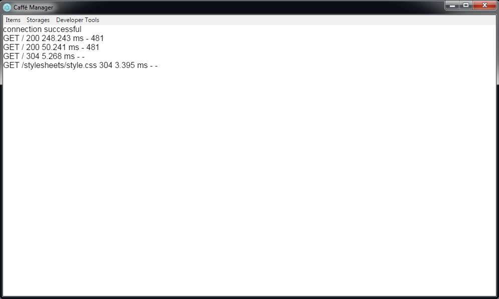
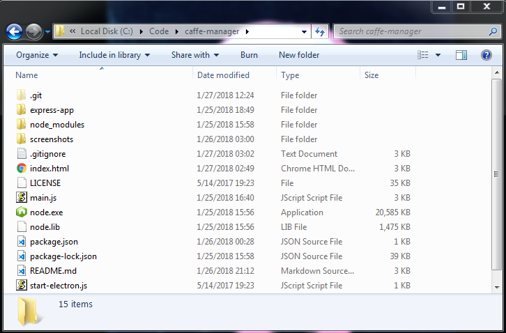

# caffè-manager

Application which will help managing the coffe shop or a store.
- NodeJS, Electron, Express, MongoDB
- Server logs in the app

Press 'F1' to show the server log:



#### Before start: Please note that this approach is intended for use in Windows platform, any other OS approach would need some changes, contributions are very welcome :)

## First

Download `Node.exe` and `Node.lib`: [https://nodejs.org/dist/v7.2.1/win-x64/](https://nodejs.org/dist/v7.2.1/win-x64/)

After downloading a copy of this repository place those files in the root of the code folder. When the Electron app starts it will spawn the Express app using an external copy of Node. This allows the Express app to run outside the Electron process.

Here is a screenshot of the file layout:



## How to run

1. Clone or download the code repo
2. Open terminal to code repository
3. Make sure a copy of `Node.exe` and `Node.lib` are copied to the root of the code repo
4. Run `npm install` in the root "caffe-manager" and in the "express-app"
folder to install all the dependencies
5. Download and install MongoDB locally
6. Run `npm start` in the root to start the application

:tada: :fireworks:

## Package with Electron-Packager

Just package it.

**Electron-Packager Tutorial**
[https://www.christianengvall.se/electron-packager-tutorial/](https://www.christianengvall.se/electron-packager-tutorial/)
That said, I'm assuming the platform is Windows. If other platforms are desirable additional changes are required.

## Running on Linux

Download standalone distribution of Node:
[https://nodejs.org/dist/latest-v7.x/node-v7.10.0-linux-x64.tar.gz](https://nodejs.org/dist/latest-v7.x/node-v7.10.0-linux-x64.tar.gz)

Unpack it into the root of the cloned repository. Then create a symbolic link called 'node' at the same location.

```
ln -sf node-v7.10.0-linux-x64/bin/node node
```

Change line 65 in index.html to the following:

```javascript
node = spawn("./node", ["./express-app/bin/www"], { cwd: process.cwd() })
```

Then you can run it like this:

```
./node start-electron.js &
```

Or edit the scripts section in 'package.json' and change it to:

```json
  "scripts": {
    "start": "./node start-electron.js"
  },
```

Then run

```
npm start
```

## License

GNU GPL v3 - see [LICENSE](LICENSE)
